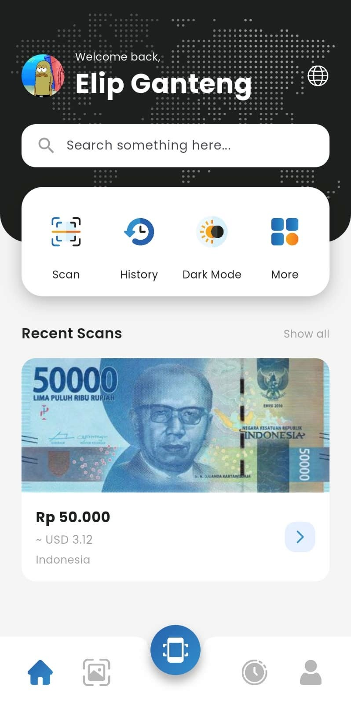
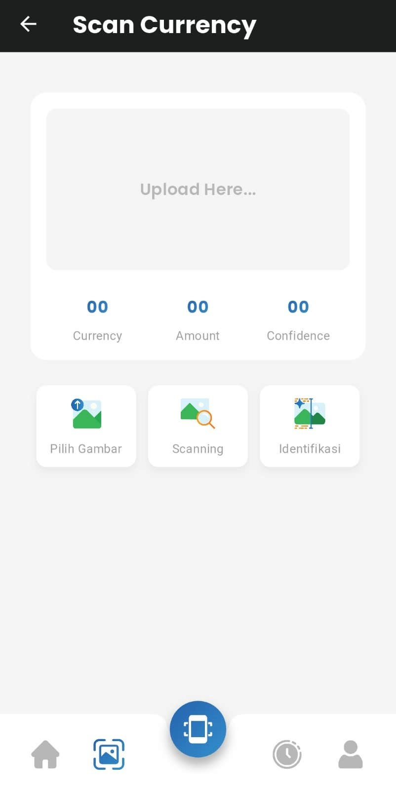
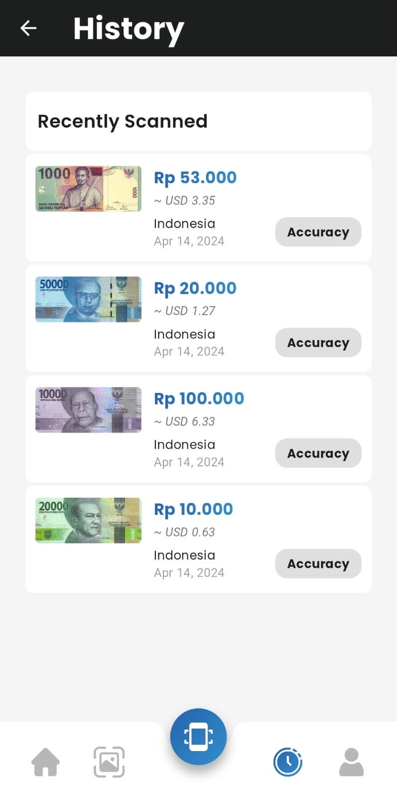

# MoneyLens: Aplikasi Deteksi dan Identifikasi Uang Kertas

**MoneyLens** adalah aplikasi mobile berbasis Flutter yang memanfaatkan teknologi pemindaian kamera dan backend Flask untuk **mendeteksi dan mengidentifikasi uang kertas** dari berbagai negara. Aplikasi ini ditujukan untuk membantu wisatawan asing dalam mengenali jenis mata uang dan nominal saat berada di Indonesia.

## Fitur Utama

- Deteksi uang kertas melalui gambar hasil kamera
- Identifikasi negara asal, jenis mata uang, dan nominal
- Backend Flask dengan image processing & template matching
- Tampilan UI sederhana dan mudah digunakan
- Mendukung IDR, USD, MYR, SGD, AUD, CNY

## Cara Kerja Aplikasi

1. Buka aplikasi dan pergi ke halaman **Scan**
2. Upload gambar uang kertas  
   *Pastikan gambar sudah ter-crop rapi dan fokus pada uangnya*
3. Tekan tombol **Identifikasi**
4. Aplikasi akan memproses gambar dan menampilkan hasil deteksi negara dan nominal

## Catatan Pengembangan

> Aplikasi ini masih dalam tahap pengembangan:
- Halaman **History** belum menyimpan data permanen
- Identifikasi belum sempurna untuk semua kondisi cahaya dan bentuk uang
- Fitur pengambilan gambar langsung & auto-crop akan dikembangkan ke depannya

## Tampilan Aplikasi

### Halaman Home
Tampilan awal aplikasi

### Halaman Scan
Upload gambar uang untuk diidentifikasi

###  Halaman History
Fitur ini belum aktif sepenuhnya

## Teknologi yang Digunakan

- **Flutter** – Frontend aplikasi mobile
- **Flask** – Backend server (Python)
- **OpenCV** – Image processing & template matching
- **Tesseract OCR** *(opsional)* – Ekstraksi teks dari gambar
- **Python** – Algoritma identifikasi uang

## Kontribusi & Pengembangan

> Jika kamu tertarik mengembangkan lebih lanjut (seperti menyimpan history, auto-detection dari kamera, atau mendukung lebih banyak mata uang), silakan fork repository ini atau buka isu/PR baru!
